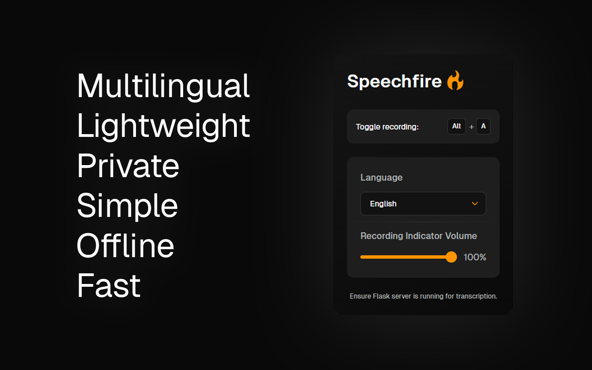

# Speechfire 



## Overview

Speechfire is a Firefox extension that provides offline speech-to-text functionality. It uses a local server for processing and supports multiple languages.

### Key Features

- 🦊✨ Firefox and Chrome support
- 🖥️ Local server for offline processing
- 🌐 Multilingual support
- ⌨️ Hotkey (`Alt+A`) to start/stop recording

## Prerequisites
### Running Linux or Windows
MacOS has some convoluted requirements to get Whisper running, so it isn't supported. Just use the system dictation tool - it works for everything.

### FFmpeg
Whisper requires [FFmpeg](https://ffmpeg.org/download.html), so you need to have it installed. It's used for a lot of things, you won't regret installing it! You can install it using package managers:

```bash
# Ubuntu/Debian
sudo apt install ffmpeg

# Windows (using Chocolatey)
choco install ffmpeg
```

## Installation

1. **Set up Python environment**

   ```bash
   python -m venv speechfire
   source speechfire/bin/activate  # On Windows: speechfire\Scripts\activate
   pip install -r requirements-lock.txt # confirmed working
   # or
   pip install -r requirements.txt # latest versions, may break
   ```

2. **Install Extension**
- Add the extension via the official [Firefox Add-ons site](https://addons.mozilla.org/en-US/firefox/addon/speechfire/) or [Chrome Web Store](https://chromewebstore.google.com/detail/speechfire/ehcikcfkjplgancoaapobfmfjhbdomdm?hl=en)
   - Or install from source:
     - Manually install `extension-firefox.xpi` in Firefox
     - Manually install `extension-chrome.zip` in Chrome

## Usage

1. **Start the server**

   ```bash
   python server.py
   ```

   Or use the system tray icon:

   ```bash
   # On Windows:
   python system-tray/start_tray_windows.py
   # On Linux:
   python system-tray/start_tray_linux.py
   ```

   After launching the system tray application:

   1. Right-click on the tray icon
   2. Select "Start Server" from the menu

2. **Use the extension**

   - Focus on a text field in Firefox
   - Press `Alt+A` to start/stop recording
   - Transcription will appear in the focused field

3. **Stop the server**
   - Press `Ctrl+C` in the terminal
   - Or use the system tray icon menu

## Icon Guide

- Extension icon:
  -  Recording
  -  Not recording
- System Tray:
  -  Server running
  -  Server not running

## Troubleshooting

### Changing the Extension Hotkey
If you need to change the default `Alt+A` hotkey:
- Go to Firefox Settings → Extensions & Themes → Manage Extensions
- Click the gear icon ⚙️ next to Speechfire
- Select "Manage Extension Shortcuts"
- Set your preferred key combination

## Additional Notes

- For Linux system tray support:
  ```bash
  sudo apt install python3-gi python3-gi-cairo gir1.2-gtk-3.0 gir1.2-appindicator3-0.1
  pip install PyGObject
  ```
- You can also create a file to launch the system tray application at startup
